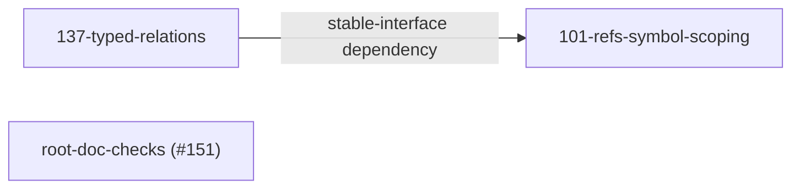

# Cross-package dependencies

Top-level, **non-sibling-scoped** — deliberately NOT inside any one `docs/design/<slug>/`
directory, and not reachable via `scope: "sibling"` from any package's own docs. Every
other structural claim a design package makes about ITSELF lives sibling-scoped, inside
that package's own directory (`checks.coverage`'s `scope: "sibling"` — see `CONVENTION.md`).
A claim about a DIFFERENT package's state is not about this package at all, so it does not
belong inside a sibling-scoped roadmap.md as free prose — that was exactly the failure this
file exists to close: `137-typed-relations/roadmap.md` once asserted `101-refs-symbol-scoping`'s
own release priority inline ("ADR 0004's own Release 1 (`refs.scope`)... should ship first
regardless of this design's fate"), a claim nothing structurally tracked, so it went stale
silently and needed a hand-added "status update, added after the fact" patch once 101
actually shipped. This file is the one place a cross-package relation is recorded, so it can
go stale LOUDLY (a broken link, caught by `cairn check`) instead of silently (a true-when-
written sentence buried in another package's roadmap that nothing re-checks).

## Vocabulary

Plain, framework-free terms native to software dependencies — not an imported
organizational framework. (An earlier draft of this file borrowed Team Topologies'
interaction-mode vocabulary; dropped on review — this is a single-maintainer repo with no
teams, no handoffs, no service boundaries, and stretching "team" to mean "a tool" to make
the framework apply at all was the tell that it was the wrong fit for this repo's actual
scale. The underlying MECHANISM below — a structured, checkable dependency register — is
unchanged; only the label was wrong.)

- **Stable-interface dependency** — the dependent package consumes the other's
  already-shipped, stable output through its public surface (an API, a config schema, a CLI
  flag), with no ongoing coordination needed. The dependency is on WHAT SHIPPED, not on
  anyone's continued attention. **The only kind actually used in this repo today.**

**Only one kind is defined — deliberately, not an oversight.** Two other shapes are
conceivable (work that's actively co-evolving across both packages at once; a one-time,
temporary favor that isn't an ongoing dependency at all) but neither has a single real
instance in this repo to design against. This repo's own `AGENTS.md` states the same
discipline this decision applies: "don't design for hypothetical future requirements... three
similar lines is better than a premature abstraction." A three-way enum was tried first and
reverted after review confirmed (via real `cairn check` warnings) that two of the three
matched zero real docs. Add a second kind exactly when a second real instance shows up, named
from what that real instance actually needs — not before.

A package's `roadmap.md` declares the dependency via `external-dependency-kind:
stable-interface` frontmatter, and `checks.coverage` then REQUIRES that roadmap to link this
file (the `depends_on` rule, `.cairnrc.json`) — a roadmap that declares the frontmatter but
never links here fails `cairn check`. What coverage cannot check: whether the entry below
actually names the right package — read it, the same limitation every other coverage rule in
this repo already has (see `CONVENTION.md`'s automatic `ℹ️` disclaimer).

## This file's own freshness — a decision, not an oversight

This file is checked exactly like every other design-package doc: `cairn check --links-only`
fails if a link below breaks, and `cairn check --refs` (non-blocking, warning-only) flags
when a CITED file's content has changed since this file last linked it. Neither check
verifies the PROSE below is still accurate — a real relation could stay linked, and drift, and
nothing here would fail loudly. **Decided as an acceptable, disclosed limitation, not left
implicit:** this repo already has a harder mechanism available for exactly this
(`checks.freshness`, `{ rules: [{ glob, maxAgeDays }] }`, matched against real git commit
history) but has deliberately NOT enabled it anywhere in this repo — `CONVENTION.md`'s own
"judging this convention" section records why: no real "doc silently rotted" incident here to
ground a threshold in. The same reasoning applies here: this file has exactly one real entry,
written and checked today; wiring `checks.freshness` onto it now, with no real staleness
incident yet observed, would be the same premature-generalization AGENTS.md already warns
against. Revisit if this file's content is ever found stale in practice, not preemptively.

## Diagram (context map, C4-Level-1-style)

This file is already, structurally, a context map — which design packages relate to which,
and how — but everything above is prose, requiring a line-by-line read to reconstruct the
shape. A small diagram makes that shape visible at a glance: each design package is a node,
each REAL dependency (never a hypothetical one) is a labeled edge, same content as "Real
relations" below, drawn instead of narrated.



**Why a diagram convention here doesn't repeat the Team Topologies mistake.** [C4 Level 1
(system context)](https://c4model.com/) and [DDD context maps](https://www.domainlanguage.com/ddd/context-mapping/)
are MODELING notations — a way to draw "which things relate to which, and how" — used
identically by a solo project and a thousand-person org; unlike Team Topologies, they carry
no assumption about team boundaries, headcount, or organizational structure, so adopting one
here doesn't reintroduce the earlier mismatch (an organizational framework applied where no
organization exists). The diagram above draws PACKAGES, not teams — this repo's own
single-maintainer reality never has to be stretched to fit it.

**Rendering, stated honestly, not assumed.** GitHub's own Markdown renderer supports fenced
` ```mermaid ` blocks natively (has since 2022, in READMEs, issues, PRs, and any file view) —
since this is a real repository file (not an Artifact), that is the renderer that matters
most here, and it renders this diagram directly with no extra tooling. For any OTHER
renderer without Mermaid support (a plain-text editor, an older static-site generator), the
diagram degrades to an unrendered code block — the prose in "Real relations" below is the
actual source of truth either way; this diagram is a rendering aid layered on top of it, not
a replacement, and never the only place a relation is recorded.

## Real relations

### 137-typed-relations → 101-refs-symbol-scoping (stable-interface dependency)

[`137-typed-relations/roadmap.md`](./137-typed-relations/roadmap.md)'s Release 2
(`symbol:path#Name` typed objects) is scoped to reuse the SAME
`typescript/unstable/ast` scanner primitive
[`101-refs-symbol-scoping/spikes.md`](./101-refs-symbol-scoping/spikes.md) spike 4 already
validated standalone, and explicitly supersedes ADR 0004's own Release 3 once it ships (an
ADR amendment, not a silent replacement — see 137's roadmap.md, Release 2). This is a
stable-interface dependency, not co-evolving work: 137 needs 101's SHIPPED scanner/
`refs.scope` primitive to exist and be stable, not ongoing joint design work with whoever
maintains 101.

**Current state, checked directly against `src/`, not assumed:** 101's own Release 1
(`refs.scope`) has shipped ([`docs/adr/0004`](../adr/0004-refs-scoped-hashing-granularity.md),
`status: accepted`) — the precondition finding (a)/(d) originally flagged as unstructured,
staled prose ("should ship first") is now satisfied, and THIS file — not a sentence buried
in 137's roadmap — is where that fact is checked going forward: re-verify that ADR's own
`status` frontmatter and 101's `roadmap.md` Release-line whenever this entry is next
substantively edited, rather than trusting this paragraph indefinitely.

**137's own scope decision:** per 137's Release 0 ROI checkpoint, Release 2 (the part that
actually depends on 101) is currently ON HOLD, gated on a real second recurrence (see
137's `roadmap.md`). The dependency recorded here describes what WOULD be true if/when
Release 2 starts, not a currently-active consumption.
